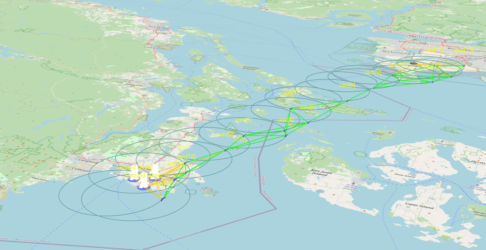
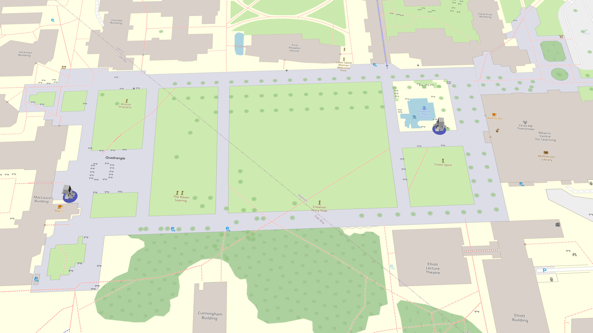
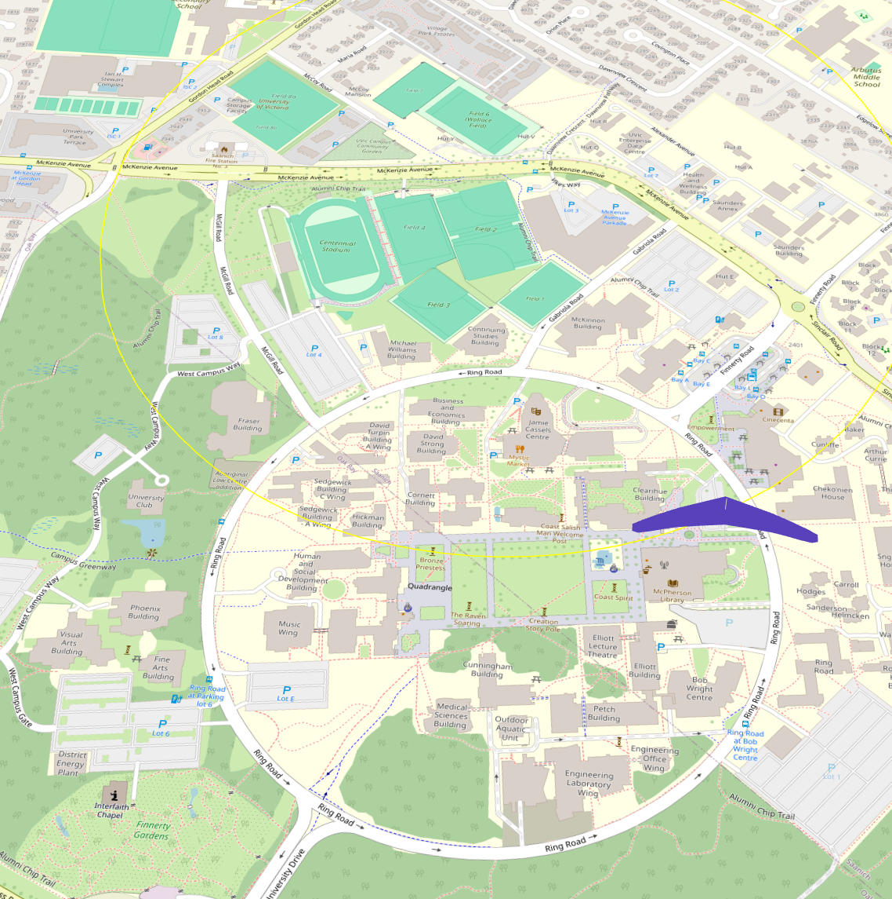

# CSC466 Group Project: Optimal Routing Protocol and Deployment Strategy for Multi-UAV Relay Networks

This repository contains public coursework artifacts for a CSC466 group project on multi-UAV relay networks and Flying Ad Hoc Networks (FANETs). The project uses OMNeT++ 6.1 to model how UAV relay nodes can support resilient communications when terrestrial infrastructure is disrupted or unavailable.

## Project Context

Communication infrastructure is vulnerable during natural disasters, large-scale outages, and military or emergency-response scenarios. Ground-based cellular and wired networks may become unavailable, while satellite communication can be expensive, high-latency, or dependent on specialized terminals.

Multi-UAV relay networks provide a rapidly deployable alternative. UAVs can act as relay nodes, gateway nodes, or aerial base-station nodes to extend connectivity for ground users. This project studies how deployment strategy and routing behavior affect coverage, connectivity, latency, and communication reliability.

## Research Objectives

The project focuses on two related questions:

1. **UAV deployment strategy**
   - Explore how UAV placement affects ground-user coverage and network connectivity.
   - Consider dynamic deployment requirements where UAV positions may need to adapt to changing connectivity conditions.
   - Evaluate coverage, hop count, and network fragmentation risks.

2. **Routing protocol behavior**
   - Study routing behavior in a multi-hop UAV relay network.
   - Consider challenges such as topology changes, wireless interference, and latency.
   - Compare routing approaches such as AODV and OLSR as reference protocols for UAV network evaluation.

## Simulation Scenario

The simulation models a Vancouver Island communication scenario in which a ground user near UVic communicates with a ground station in Vancouver through UAV relay nodes.

Key simulation assumptions:

- **Simulator:** OMNeT++ 6.1
- **Network type:** Multi-UAV relay network / FANET
- **UAV count:** 6 relay UAVs
- **Connectivity model:** line-of-sight communication
- **Traffic model:** PingApp traffic generated at regular intervals
- **Ground user range:** 3 km
- **UAV communication range:** 30 km
- **Ground station range:** 50 km

## Network Roles

- **Sender / ground user:** Generates application traffic.
- **Receiver / ground station:** Receives traffic and represents the connection to the wider network.
- **Gateway UAV:** Connects the UAV swarm to the ground station based on proximity and connectivity.
- **Mesh UAVs:** Provide multi-hop relay paths for packet forwarding.
- **LTE/5G base-station UAV:** Represents a mobile aerial access point for ground users.

## Design Challenges

The project examines several limitations of UAV relay networks:

- Wireless backhaul capacity may degrade as hop count increases.
- UAV mobility can change topology and routing paths over time.
- Line-of-sight constraints, weather, obstacles, and radio interference may reduce reliability.
- Routing and channel decisions must balance coverage, latency, and stability.

## Repository Contents

- `uav/` - OMNeT++ simulation files and project implementation artifacts.
- `img/` - project images and simulation screenshots.
- `References/` - supporting reference material.
- `update/` - project update materials.

## Notes

This repository is a public-facing coursework artifact. It is intended to document the simulation concept, implementation context, and research direction for the CSC466 group project rather than to serve as a production networking system.
